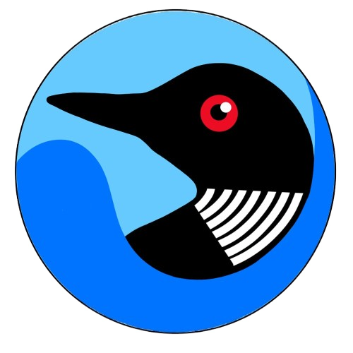

<div align="center">
    
</div>

# Gavia

Gavia is a self-hosted Go application for keeping infrastructure inventory,
billing notes, settings, and small operational dashboards in one place. It uses
server-rendered HTML with Aile, HTMX, Hyperscript, Missing.css, and SQLite.

The project is intentionally explicit:

- Go handlers render HTML templates directly.
- CRUD modules stay readable instead of becoming a generic framework.
- HTMX is used for partial updates, not as a second frontend.
- SQLite is the default storage backend.

## Current scope

The current codebase includes:

- Dashboard with due-soon summaries, expenses, FX snapshots, runtime
  diagnostics, and uptime widgets
- CRUD modules for providers, locations, operating systems, IP addresses, DNS
  records, labels, domains, hostings, servers, and subscriptions
- Singleton account settings and app settings
- Login, logout, session cookies, API token management, and recovery-key based
  password reset
- CSRF protection for browser-side unsafe requests with same-origin checks plus
  per-request tokens
- JSON backup export/import, including encrypted backups with ML-KEM + AES-GCM
- Lightweight uptime checks for HTTP targets
- Page-local frontend scripts loaded only where they are needed

## Quick start

### Dev runtime with Compose

```bash
make run
```

That target starts the `gavia-dev` compose service in the foreground.

### Native shell

```bash
make run-local
```

### Development shell

```bash
make env
```

### Container image

```bash
make image
```

### Guix package

```bash
make pkg
```

That target runs:

```bash
guix build -f ./guix.scm
```

The resulting output is a store path under `/gnu/store/...`.

### Compose

```bash
podman compose up --build gavia
```

The default runtime listens on `:9091` and stores SQLite data at
`./db/app.sqlite`.

## Build metadata

`make build` and `make run-local` inject runtime metadata with Go `-ldflags -X`.
The compose-based `make run` target uses the same source tree through the dev
container.

- `buildVersion`
- `buildTag`
- `buildCommit`
- `buildDate`
- `upstreamRepo`
- `upstreamVendor`

That is what drives the version fields shown in logs and footer diagnostics.

## Environment variables

| Variable           | Default           | Purpose                             |
| ------------------ | ----------------- | ----------------------------------- |
| `GAVIA_ADDR`       | `:9091`           | HTTP listen address                 |
| `GAVIA_DB_PATH`    | `./db/app.sqlite` | SQLite file path                    |
| `GAVIA_LOG_FORMAT` | `text`            | `text` or `json`                    |
| `GAVIA_LOG_COLOR`  | `auto`            | `auto`, `always`, or `never`        |
| `GAVIA_LOG_LEVEL`  | `info`            | `debug`, `info`, `warn`, or `error` |

## Frontend assets

The frontend uses vendored libraries and small page-local scripts served
directly from `static/js/`. There is no bundling or transpilation step.

The asset pipeline is documented in
[docs/ASSET_PIPELINE.md](./docs/ASSET_PIPELINE.md).

## Documentation

### External and operational docs

- [API reference](./docs/API_REFERENCE.md)
- [Architecture overview](./docs/ARCHITECTURE.md)
- [Asset pipeline](./docs/ASSET_PIPELINE.md)
- [Guix packaging](./docs/GUIX.md)

### Internal maintenance docs

- [CRUD extension playbook](./docs/CRUD_EXTENSION_PLAYBOOK.md)
- [Tempel snippets](./docs/TEMPEL_SNIPPETS.md)

## Tests

```bash
env CGO_ENABLED=0 GOCACHE=/tmp/go-build go test ./...
```

## License and attribution

Where applicable, the source code of this project is licensed under the GNU
Affero General Public License version 3 or, at your option, any later version.

The in-app `/licenses` page is intentionally editable as project content. Its
base template lives at:

- [`internal/ui/features/licenses/views/index.html`](./internal/ui/features/licenses/views/index.html)

Third-party components currently used by the project include:

| Library              | License         |
| -------------------- | --------------- |
| `aile`               | AGPL-3.0+       |
| `modernc.org/sqlite` | BSD-3-Clause    |
| `htmx`               | Zero-Clause BSD |
| `hyperscript`        | Zero-Clause BSD |
| `missing.css`        | BSD-2-Clause    |

The Go standard library is distributed under the BSD-3-Clause license.

The `avatar-X.svg` files are based on DiceBear Rings avatars:

> [Rings](https://www.dicebear.com/styles/rings/) by
> [DiceBear](https://www.dicebear.com/), licensed under
> [CC0 1.0](https://creativecommons.org/publicdomain/zero/1.0/)
